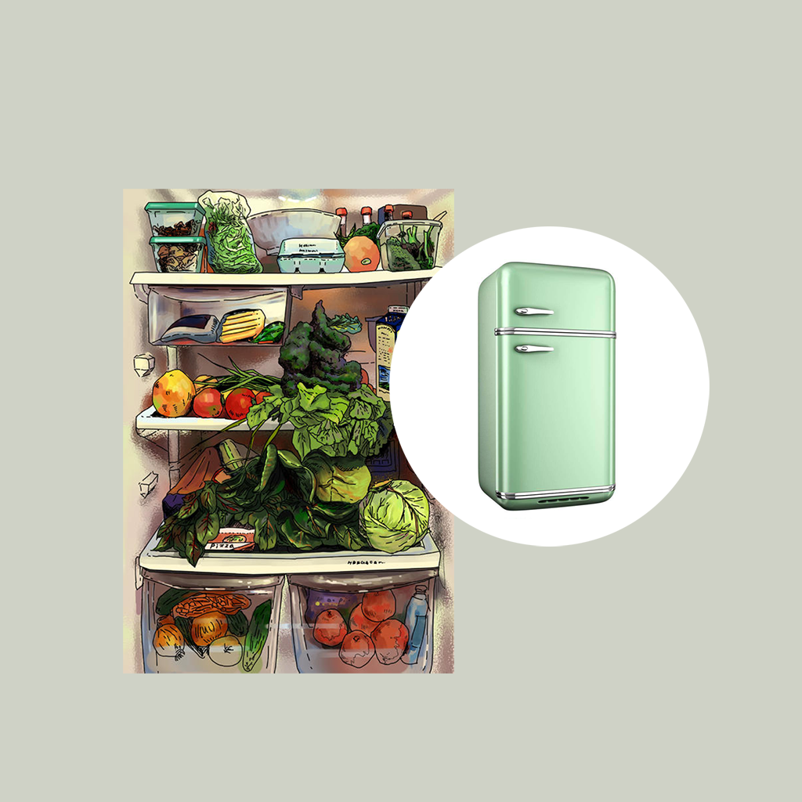

## 欢迎来到 我的冰箱食物存储时间记录

在我们日常生活中，经常会将食物储存在冰箱里，以保持食物新鲜状态和不会变质。但是我们经常会忘记冰箱里的各种食物存储了多长时间，是否快要过期，或者已经过期等，导致食物的浪费。我们可以利用这款应用，记录家里冰箱放了哪些食物，保质期，已经存储时间，是否新鲜以及即将计划如何使用该食物等安排。这样我们就可以将这些记录整理成列表，方便我们管理冰箱里的食物。

如果您遇到什么需要解答的问题，请发送您的问题到以下邮箱。

我们将第一时间为您解答。

### 邮箱地址:  jichungan9498@163.com

谢谢！
